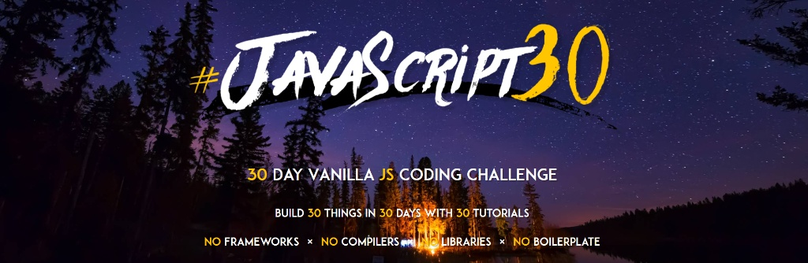

# 🚀 JavaScript30 Challenge 

Welcome to my JavaScript30 repository! This repo documents my journey of completing the 30-day vanilla JavaScript coding challenge. The premise is simple: build 30 projects in 30 days.

**No frameworks. No libraries. No compilers. No boilerplate.** Just pure HTML, CSS, and JS.

---

## 🙌 Acknowledgements & Inspiration

This repository is built following the incredible **[JavaScript30](https://javascript30.com/)** course created by **[Wes Bos](https://wesbos.com/)**. Huge thanks to Wes for putting together this fantastic, hands-on learning resource for the developer community! 

---

## 🎯 Goals

- **Solidify Fundamentals:** Deepen my understanding of core JavaScript concepts.
- **Master the DOM:** Get highly comfortable with DOM manipulation and browser APIs without relying on external libraries like jQuery or React.
- **Learn by Doing:** Build practical, real-world projects instead of getting stuck in "tutorial hell."
- **Build Consistency:** Code every single day and complete the 30-day streak.

---

## 🛠 Tech Stack

---

## 📅 Progress Tracker

- [x] **Day 01** - Drum Kit
- [x] **Day 02** - CSS + JS Clock
- [x] **Day 03** - CSS Variables
- [x] **Day 04** - Array Cardio, Day 1
- [x] **Day 05** - Flex Panel Gallery
- [ ] **Day 06** - Type Ahead
- [ ] **Day 07** - Array Cardio, Day 2
- [ ] **Day 08** - Fun with HTML5 Canvas
- [ ] **Day 09** - Dev Tools Domination
- [ ] **Day 10** - Hold Shift to Check Multiple Checkboxes
- [ ] **Day 11** - Custom Video Player
- [ ] **Day 12** - Key Sequence Detection
- [ ] **Day 13** - Slide in on Scroll
- [ ] **Day 14** - JavaScript References vs Copying
- [ ] **Day 15** - LocalStorage
- [ ] **Day 16** - Mouse Move Shadow
- [ ] **Day 17** - Sort Without Articles
- [ ] **Day 18** - Adding Up Times with Reduce
- [ ] **Day 19** - Webcam Fun
- [ ] **Day 20** - Speech Detection
- [ ] **Day 21** - Geolocation
- [ ] **Day 22** - Follow Along Link Highlighter
- [ ] **Day 23** - Speech Synthesis
- [ ] **Day 24** - Sticky Nav
- [ ] **Day 25** - Event Capture, Propagation, Bubbling, and Once
- [ ] **Day 26** - Stripe Follow Along Nav
- [ ] **Day 27** - Click and Drag
- [ ] **Day 28** - Video Speed Controller
- [ ] **Day 29** - Countdown Timer
- [ ] **Day 30** - Whack A Mole

---

## 📌 Personal Notes

My primary focus throughout this challenge is to completely avoid "mindless typing." I am actively focusing on understanding *why* the code works, reading documentation for unfamiliar methods, and adding my own improvements to each daily project. 

*I will be updating this repo daily as I complete each challenge!*

---

## ⭐ Get Involved

If you're also taking on this challenge, feel free to fork this repo, leave a star, or follow along. Let's learn together!
